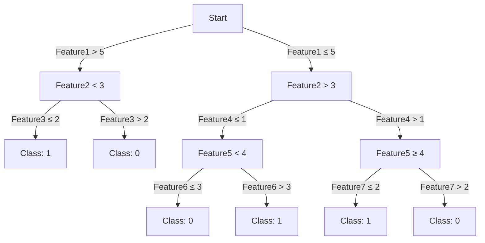
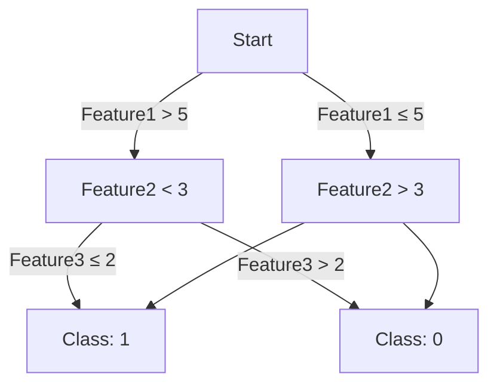
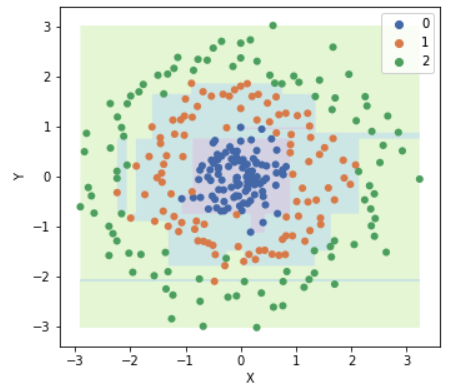
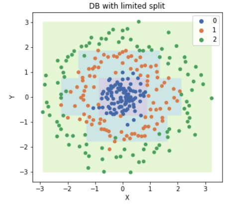

# Cây Quyết Định

Cây quyết định (Decision Tree) là một mô hình học máy được sử dụng cho cả phân loại (classification) và hồi quy (regression). Nó hoạt động dựa trên cấu trúc cây, nơi mỗi nút biểu diễn một quyết định hoặc một phân nhánh dựa trên một thuộc tính của dữ liệu, và mỗi là của cây đại diện cho một kết quả hoặc dự đoán.

## Định nghĩa

- **Cấu trúc Cây**: Cây quyết định bắt đầu từ một nút gốc và mở rộng ra các nhánh dựa trên các quyết định liên quan đến thuộc tính của dữ liệu.
- **Nút và Lá**: Mỗi nút trên cây đặt một câu hỏi về một thuộc tính, và mỗi nhánh từ nút đó tương ứng với một trong các câu trả lời có thể. Các nút cuối cùng, không có nhánh con, được gọi là lá và chứa dự đoán hoặc kết quả.

## Khái niệm

- **Phân loại và Hồi Quy**: Trong phân loại, cây quyết định dùng để xác định nhãn lớp cho dữ liệu, còn trong hồi quy, nó dự đoán giá trị số.
- **Phân chia Dựa trên Thuộc tính**: Các quyết định về cách phân chia dữ liệu tại mỗi nút thường dựa trên các phép đó như Gini Impurity, Entropy hoặc Information Gain.
- **Tính Trực quan và Dễ Hiểu**: Một ưu điểm lớn của cây quyết định là chúng rất trực quan và dễ hiểu, ngay cả đối với những người không chuyên về học máy.
- **Overfitting**: Một thách thức khi sử dụng cây quyết định là chúng dễ dàng overfitting, tức là mô hình quá phù hợp với dữ liệu huấn luyện và không tổng quát hóa tốt trên dữ liệu mới.
- **Underfitting**: xảy ra khi cây không đủ phức tạp để nắm bắt các mô hình cơ bản hoặc các quy luật trong dữ liệu. Điều này thường xảy ra khi mô hình quá đơn giản so với độ phức tạp của dữ liệu thực tế mà nó cần học.

## Ứng dụng

Cây quyết định được ứng dụng rộng rãi trong nhiều lĩnh vực từ y khoa, tài chính, marketing, đến các hệ thống khuyến nghị và nhiều hơn nữa, nhờ khả năng cung cấp quyết định dựa trên dữ liệu một cách rõ ràng và dễ hiểu.

## Ví dụ về Overfitting

Hãy tưởng tượng bạn đang xây dựng một mô hình học máy để dự đoán giá nhà dựa trên diện tích và vị trí. Trong trường hợp của overfitting:

- **Trong Dữ Liệu Huấn Luyện**: Mô hình có thể học rất tốt từ dữ liệu huấn luyện, thậm chí nắm bắt cả những chi tiết nhỏ như một ngôi nhà cụ thể có giá cao vì nó gần một cây cổ thụ đẹp.
- **Trong Dữ Liệu Thực Tế**: Khi mô hình này được áp dụng cho dữ liệu mới, nó sẽ không hoạt động tốt vì không phải tất cả các ngôi nhà gần cây cố thụ đều đắt. Mô hình đã học "quy tắc" không chính xá từ dữ liệu huấn luyện.

### **Cây bị overfitting**

### **Cây không bị overfitting**

Nên biểu diễn dưới dạng sơ đồ để dễ hiểu hơn. Đây là Ví dụ khác.

Cắt nó đi

### Nguyên Nhân của Overfitting

- **Dữ liệu Huấn Luyện Có Hạn**: Nếu dữ liệu huấn luyện không đủ đa dạng hoặc quá ít, mô hình có thể "học thuộc lòng" chúng thay vì học cách tổng quát hóa
- **Mô Hình Quá Phức Tạp**: Mô hình với quá nhiều tham số (như một mạng lưới nơ-ron sâu và phức tạp) có thể nắm bắt quá mức chi tiết trong dữ liệu huấn luyện.
- **Không Có Hạn Chế về Độ Sâu của Cây**: Nếu không có hạn chế về độ sâu, cây có thể phát triển quá mức ần thiết để phản ánh chính xác các mẫu trong dữ liệu huấn luyện.

## Giới hạn độ sâu

Giới hạn độ sâu của cây quyết định là một kỹ thuật được sử dụng trong học máy để ngăn chặn việc overfitting của cây quyết định. Độ sâu của cây quyết định chỉ số lượng tầng hoặc cấp của nút từ nút gốc đến nút lá sâu nhất. Đặt giới hạn cho độ sâu này có những tác động sau:

### Mục Đích
- **Ngăn Chăn Overfitting**: Giới hạn độ sâu giúp ngăn chặn việc mô hình học quá mức từ dữ liệu huấn luyện, bao gồm cả nhiễu và các chi tiết không quan trọng.
- **

## Cây bị underfitting

## So sánh Entropy, Information Gain và Gini Impurity

### Entropy

- **Ưu điểm**:
    - Tốt trong việc đo lường mức độ hỗn loạn hay không chắc chắn trong dữ liệu.
    - Thích hợp cho việc phân loại cân đối giữa các lớp
- **Nhược điểm**:
    - Tính toán phức tạp hơn do cần tính logarit.

### Information Gain

- **Ưu điểm**:
    - Hiệu quả trong việc đánh giá sự cải thiện mà một thuộc tính mang lại cho việc phân loại.
    - Dựa trên Entropy, nó cung cấp cái nhìn sâu sắc về lượng thông tin thu được từ một thuộc tính.
- **Nhược điểm**:
    - Có thể thiên vị với các thuộc tính có nhiều giá trị khác nhau.
    - Có thể dẫn đến overfitting nếu không được sử dụng cẩn thận.

### Gini Impurity

- **Ưu điểm**:
    - Tính toán đơn giản và nhanh chóng hơn so với Entropy.
    - Hiệu quả trong việc phân chia dữ liệu, đặc biệt khi số lượng lớp không quá lớn.
- **Nhược điểm**:
    - Có thể không hiệu quả như Entropy trong một số trường hợp phức tạp hoặc khi có nhiều lớp phân loại.

### Nhận Xét Chung

- **Chọn lụa phương pháp**: Lựa chọn giữa Gini Impurity và Entropy/Information Gain thường phụ thuộc vào các yêu cầu cụ thể của bài toán và dữ liệu. Trong nhiều trường hợp, sự khác biệt giữa chúng không đáng kể về mặt hiệu suât.
- **Độ chính xác và hiệu suất**: Trong khi Entropy và Information Gain có thể cung cấp cái nhìn sâu sắc và chính xác, Gini thường được ưa chuộng vì tính toán nhanh và đơn giản.
- **Cân nhắc về dữ liệu**: Khi làm việc với dữ liệu có nhiều thuộc tính hoặc các thuộc tính có nhiều giá trị khác nhau, cần cân nhắc kỹ lưỡng về sự lựa chọn giữa Information gain và Gini để tranh thiên vị hoặc overfiting.
